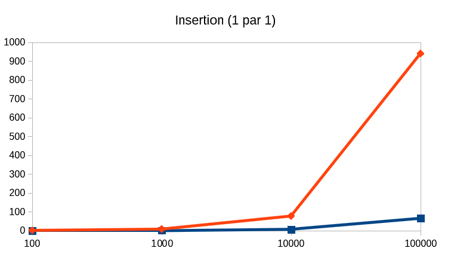
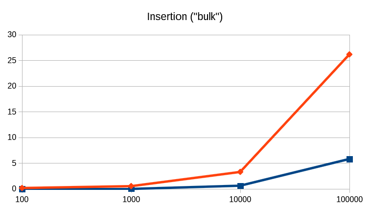
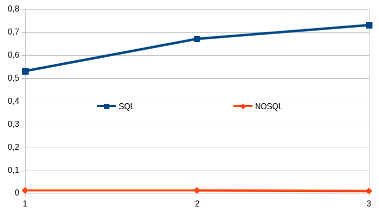

# Etude comparative entre MySQL et Elasticsearch

*Antoine Haas, Jason Golda*

GitHub : https://github.com/a-haas/traitement-donnees-reparties

Depuis plusieurs années maintenant, le nombre de données à traiter augmente sans cesse ce qui a entraîné une visibilité importante concernant le big data. Ce changement s'est également répercuté sur le choix des systèmes de bases de données où les systèmes SQL ne sont plus l'unique solution et par soucis de rapidité ainsi que de performances, les systèmes NOSQL ont ainsi vu leur popularité grandir fortement.

Concernant cette étude comparative entre système SQL (MySQL) et NOSQL (Elasticsearch), les fonctions de recherches seront fortement mises en avant afin de pouvoir déterminer le gain d'utilisation d'un système NOSQL ainsi que les faiblesses que peuvent apporter de tels outils.

## Installation et configuration

Système utilisé : Ubuntu 16.04

### MySQL

Pour installer le serveur Mysql

    sudo apt-get install mysql-server
    sudo apt-get install libmysqlclient-dev

Installation de la librairie python mysql  

    sudo apt-get install python-mysqldb 

### Elasticsearch
Pour installer Elasticsearch sur la distribution Ubuntu merci de suivre ce guide [https://www.elastic.co/fr/downloads/elasticsearch]()

Concernant la libraire python 

    pip install elasticsearch

## Jeu de données

Le jeu de données, ainsi que divers explications sur celui-ci peuvent être trouvées à l'adresse suivante [https://www.kaggle.com/zynicide/wine-reviews]()

Le jeu de donnnées qui est exploité pour ce projet est le fichier `winemag-data-130k-v2.json`.

## Outil de mesures

Les mesures sont réalisées à l'aide d'un script Python qui mesure le temps d'exécution (temps réel et temps processeur) en permettant l'insertion, la mise à jour ainsi que la récupération du jeu de données dans la base de données. Le script permet ainsi d'exécuter ces commandes en précisant le système de gestion à utiliser (SQL ou NOSQL).

Utilisation classique

	python <wine_reviews>.json db method [--size s] [--query q]

* db : sql, nosql
* method : reset, insert, getall, get
* size : La taille des données à traiter (nombre de lignes à récupérer depuis la base, nombre de reviews à récupérer depuis le fichier, etc...) 
* query : requête elasticsearch/sql

Suppression / création des bases de données

	python main.py wine-reviews/winemag-data-130k-v2.json sql reset

Insertion dans la base de données (1 ligne après l'autre)

	python main.py wine-reviews/winemag-data-130k-v2.json sql insert [--size s]

Insertion dans la base de données (plusieurs lignes à la fois)

	python main.py wine-reviews/winemag-data-130k-v2.json sql bulk [--size s]

Récupération de l'intégralité des données de la base

	python main.py wine-reviews/winemag-data-130k-v2.json sql getall

Récupération de données à l'aide d'une query

	python main.py wine-reviews/winemag-data-130k-v2.json sql get --query q

## Comparatif des résultats

Elasticsearch est avant tout un moteur de recherche avant d'être un une base de données. Ainsi les performances sont fortement orientées vers la recherche de documents et le benchmarking a ainsi pour objectif de cibler ces principales points de comparaisons.

### Insertion des données

```
python main.py wine-reviews/winemag-data-130k-v2.json sql insert [--size s]
```


| Nombre de lignes | SQL (en s) | NOSQL (en s) |
| ---------------- | ---------- | ------------ |
| 100              | 0,11       | 0,8          |
| 1000             | 0,6        | 7,6          |
| 10000            | 6,7        | 77,08        |
| 100000           | 65         | 941          |



*L'axe des Y comporte le temps en secondes requiert pour exécuter une requête et l'axe des X comporte quant à lui le nombre de données utilisées. (bleu : MySQL / orange : elasticsearch)*

On peut remarquer que les résultats, comme ce qui est attendu, sont largement favorables à MySQL. En effet, Elasticsearch possède, lors de l'indexation un fort *overhead*, afin de fournir une indexation de meilleure qualité, notamment pour effectuer les recherches par la suite. Cette partie ci peut-être améliorée, en grande partie pour l'insertion d'un grand nombre de données, à l'aide de requête de type *bulk*. 

Une autre remarque qui peut être fait, et qui semble tout à fait cohérente, est la linéarité entre le nombre de données et le temps. Ainsi, lors d'ajout successif (en se servant d'une requête par objet), le fait de réaliser un ajout massif de données est cohérent par rapport à un faible ajout. Cependant comme précisé au-dessus, le processus d'indexation de base est cependant très lent.

### Amélioration de l'insertion des données

L'insertion des données est, sans aucun doute, une opération inutile pour remplir une base de données en un seul essai. En effet, il est bien plus optimisé de fournir l'intégralité des données en une seule requête. Pour celà, une nouvelle série de mesures pour voir l'amélioration des résultats.

Script utilisé :

```
python main.py wine-reviews/winemag-data-130k-v2.json sql insert [--size s]
```

| Nombre de lignes traitées | SQL   | NOSQL |
| ------------------------- | ----- | ----- |
| 100                       | 0,009 | 0,15  |
| 1000                      | 0,018 | 0,51  |
| 10000                     | 0,6   | 3,28  |
| 100000                    | 5,8   | 26,15 |



*L'axe des Y comporte le temps en secondes requiert pour exécuter une requête et l'axe des X comporte quant à lui le nombre de données utilisées. (bleu : MySQL / orange : elasticsearch)*

Bien évidemment MYSQL est toujours bien plus rapide lors de l'indexation mais il est tout de fois à noter que le temps requis pour Elasticsearch a **drastiquement** diminué et est passé de près de *950 s* à seulement *26 s*. On est ainsi passé d'un coefficient de différence entre MySQL et Elasticsearch qui était presque de **15** à un coefficient de **5**. Ainsi si l'opération d'indexation des requêtes est effectués manuellement il est alors possible de gagner énormément de temps lors de l'insertion des données.

### Recherche des données

Cette partie est le coeur de ce rapport, dans le sens où il s'agit réellement de l'intêret de l'étude car il s'agit du point fort d'Elasticsearch et énormément mis en avant dans la démarche commercial. Cependant après un grand nombre de tentative, plusieurs heures de recherche et une réflexion sur le sujet, la comparaison de but en blanc n'a que très peu d'intêret. En effet, les buts recherchés par les deux moteurs sont complètement différents et il est difficile de pouvoir faire un comparatif de manière égal car les langages de requêtes sont complètement à l'opposé. Voici les deux raisons pour lesquels les deux moteurs ne sont pas comparables dans leur manière d'effectuer les recherches ainsi que les réponses obtenues :

* MYSQL a pour objectif de fournir l'ensemble des données demandées par la requête
* Elasticsearch a pour objectif de fournir les données les plus pertinentes (en permettant un flou des chaînes de caractères) liées à la requête mais en nombre limité (cependant récupérable en plusieurs requêtes HTTP et non en base car lors de la première requête les autres résultats seront conservés dans le cache). *PS* : Un simple LIMIT dans la requête SQL ne permet pas non de se rapprocher de la réalité, les résultats d'Elasticsearch étant mis en cache lors de la requête (augmentant ainsi le temps de réponse).

Pour prouver la différence totale des buts, des mesures ont été faites en fonction de chacun des points forts des moteurs :

**MySQL**

Premièrement, on compare MySQL et Elasticsearch en fonction de la récupération de l'intégralité des données de la base.

```
python main.py wine-reviews/winemag-data-130k-v2.json sql getall
```

| Nombre de lignes traitées | SQL   | NOSQL |
| ------------------------- | ----- | ----- |
| 130000                    | 2,3 s | 8,2 s |

Elasticsearch est 4 fois plus lent que SQL et ceci est principalement dû au fait qu'il est nécessaire d'effectuer un nombre conséquent de requêtes supplémentaires (environ 12 car une limite de 1000 résultats par requête a été paramétré).

**Elasticsearch**

Deuxièmement, la comparaison se base sur une simple requête de comparaison de chaine de caractères en augmentant par la suite le nombre de conditions de la requête. Celle-ci se focalise sur les chaînes, et non les chiffres, car les recherches des moteurs de recherche sont d'avantage en adéquation pour ce cas de figure.

La commande utilisée est la suivante :

```
python main.py wine-reviews/winemag-data-130k-v2.json sql get --query q
```

 Le paramètre `q` est à remplacer successivement par les requêtes ci-dessous :

1. **Requête 1**

```json
{"query":{"match":{"description":"citrus"}}}
```

```sql
SELECT * FROM Wines WHERE description LIKE '%citrus%'
```

2. **Requête 2**

```json
{"query":{"match":{"description":"citrus"}, "match":{"variety":"pinot"}}}
```

```sql
SELECT * FROM Wines WHERE description LIKE '%citrus%' OR variety LIKE '%pinot%'
```

3. **Requête 3**

```json
{"query":{"match":{"description":"citrus"}, "match":{"variety":"pinot"}, "match":{"region1":"Alsa"}}}
```

```sql
SELECT * FROM Wines WHERE description LIKE '%citrus%' OR variety LIKE '%pinot%' OR region1 LIKE '%Alsa%'
```

| Query | SQL  | NOSQL |
| ----- | ---- | ----- |
| 1     | 0,53 | 0,011 |
| 2     | 0,67 | 0,011 |
| 3     | 0,73 | 0,008 |



Il n'est pas conseillé de comparé les résultats de manière directe car ceux-ci sont biaisés, comme évoqué avant. En effet, MySQL retourne l'intégralité de la requête alors qu'Elasticsearch renvoie que les premiers résultats, et ceux qui sont le plus pertinents. Les requêtes, cependant sont similaires car le traitement par défaut d'Elasticsearch est de traité les matchs en tant que OR (cependant ceci n'est pas repérable dans les premiers résultats car les résultats matchant tous les attributs sont récupérés en premier).

Toutefois il est possible d'affirmer le fait qu'Elasticsearch est largement mieux placé sur ce point par rapport à MySQL car au fil des requêtes, qui sont de plus en plus *complexes*, le temps de réponse diminue, à l'inverse de MySQL qui passe de près de 0,5 secondes à 0,75 secondes en effectuant une recherche sur seulement 2 champs supplémentaires.

## Conclusion

Il est important de noter que chacune des base de données ont des objectifs totalement différents et il n'est pas nécessaire d'utiliser un moteur de recherche du genre d'Elasticsearch si le besoin ne se fait pas ressentir. 

Les points forts d'Elasticsearch sont donc :

* Forte nécessité d'utiliser un moteur de recherche à fonctionnalités poussées
* Facilité de mise en place du système et d'administration
* Interface de programmation très agréable (API HTTP)

Le point faible, mais assumé d'Elasticsearch :

* Certaines requêtes sont difficiles (voir impossible) à écrire, alors que celle-ci sont pourtant simple pour un SGBD traditionnel (SQL ou même NOSQL)